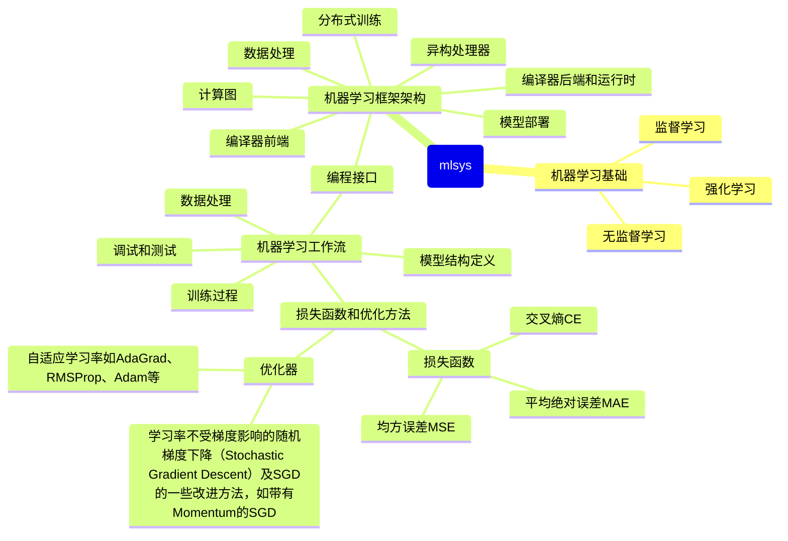

```mermaid
mindmap
    root(mlsys)
        机器学习基础
            监督学习
            无监督学习
            强化学习
        机器学习框架架构
            编程接口
                机器学习工作流
                    数据处理
                    模型结构定义
                    损失函数和优化方法
                        损失函数
                            均方误差MSE
                            平均绝对误差MAE
                            交叉熵CE
                        优化器
                            学习率不受梯度影响的随机梯度下降（Stochastic Gradient Descent）及SGD的一些改进方法，如带有Momentum的SGD
                            自适应学习率如AdaGrad、RMSProp、Adam等

                    训练过程
                    调试和测试
            计算图
            编译器前端
            编译器后端和运行时
            异构处理器
            数据处理
            模型部署
            分布式训练
        

```