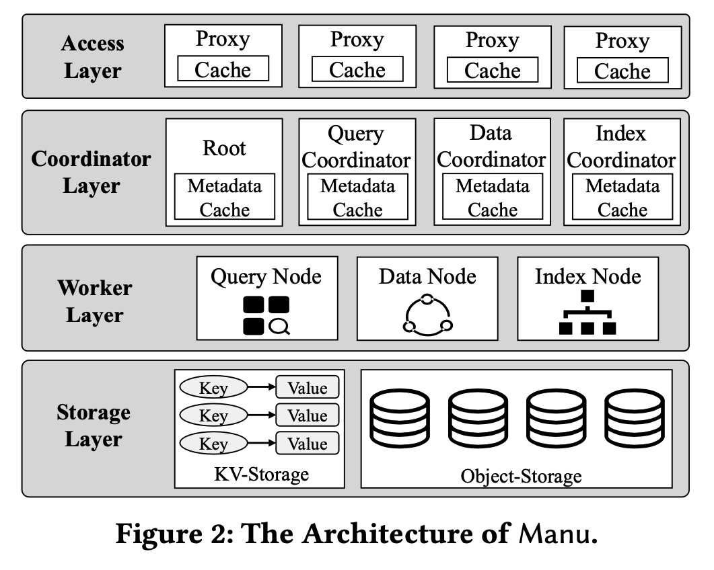
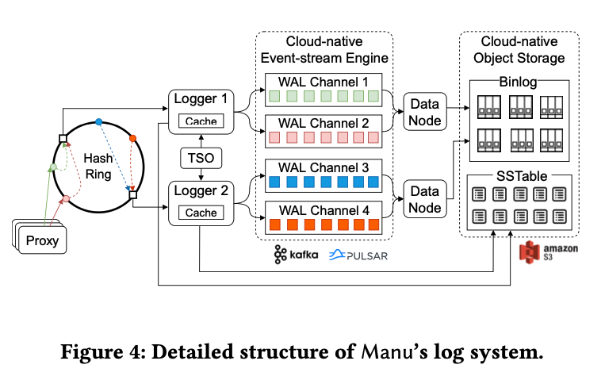
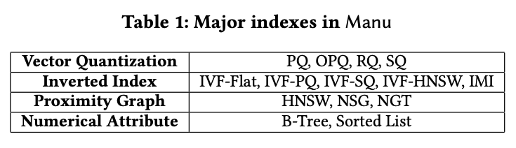
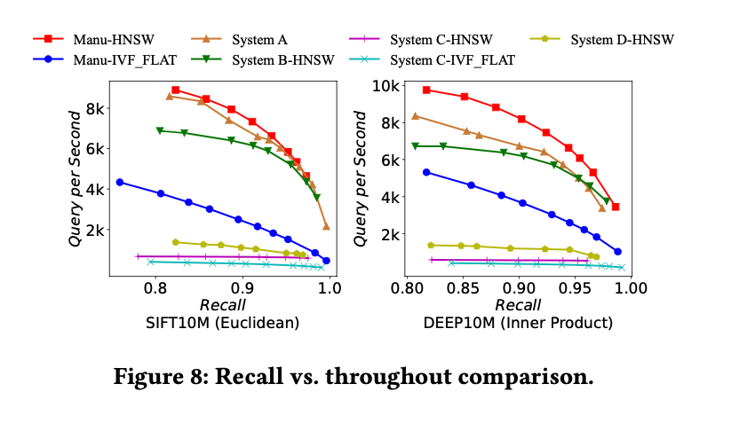
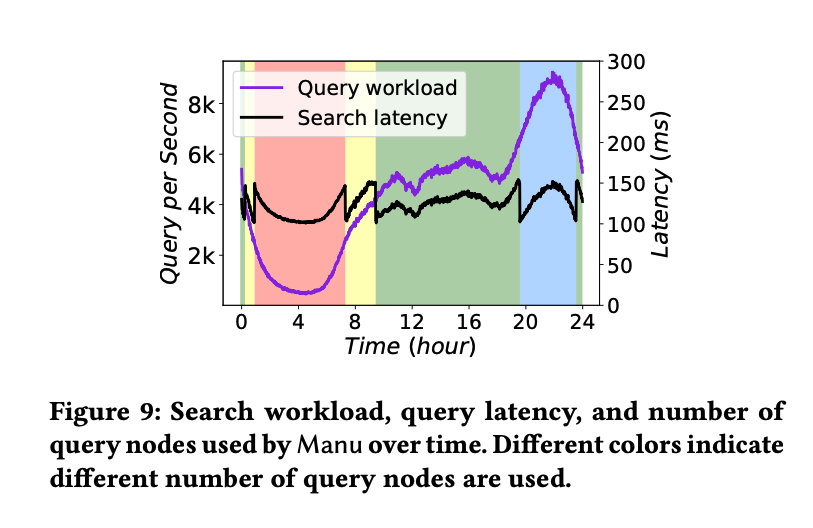
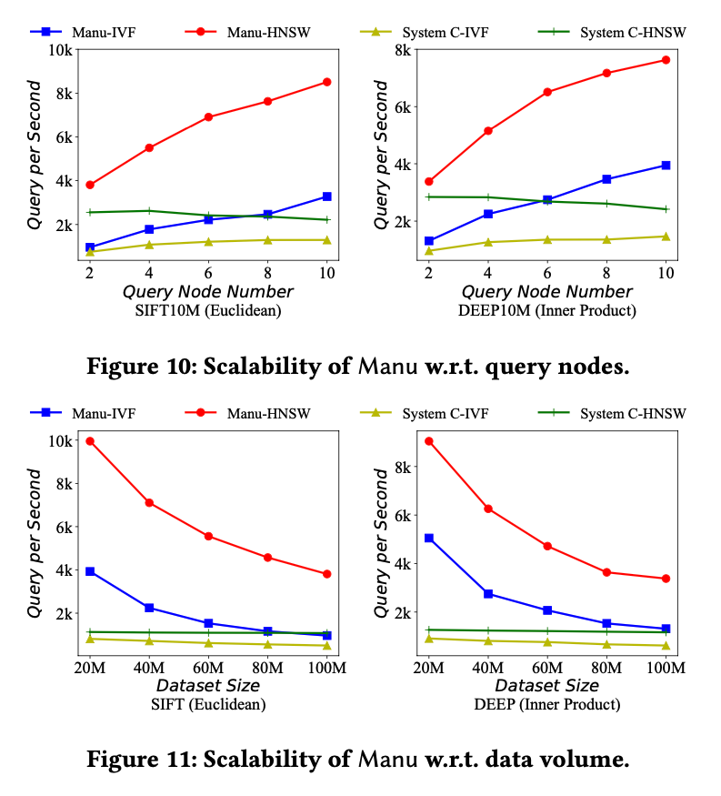
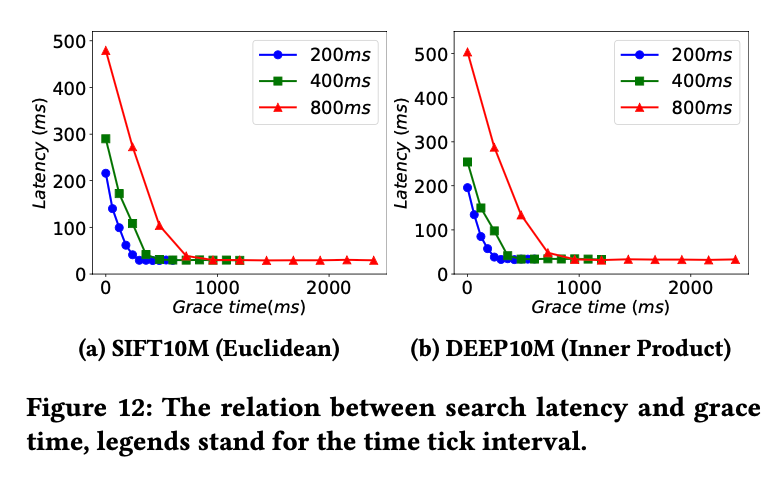
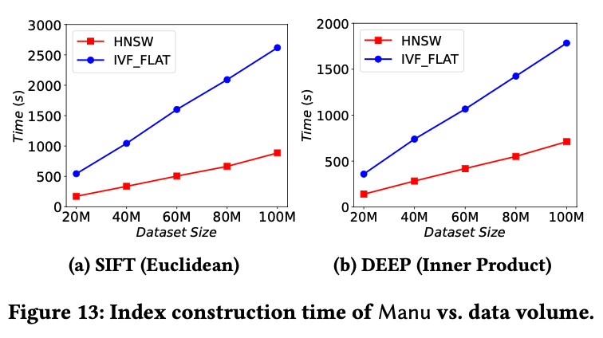

# (Paper Reading) Manu: A Cloud Native Vector Database Management System

这篇文章同样是 VLDB 的一篇文章，讲的是云原生向量数据库。

首先按照惯例问一下 chatGPT，什么是向量数据库：

```
向量数据库（Vector Database）是一种专门用于存储、管理和查询向量数据的数据库系统。向量数据是由向量（Vector）组成的数据集合，其中每个向量代表了一个数据点或实体的特征表示。

传统的关系型数据库或文档型数据库主要以标量数据为基础，而向量数据库专注于处理和分析向量数据。它提供了针对向量数据的高效存储和检索机制，以及针对向量的特定操作和查询功能。

向量数据库通常具备以下特点和功能：

1. 高维向量存储：向量数据库能够有效地存储和管理高维向量数据。它使用高效的数据结构和索引机制，以支持在大规模向量集合中进行高效的查询和分析。

2. 向量相似性搜索：向量数据库提供了针对向量相似性搜索的功能。它能够根据向量之间的相似性度量，如欧氏距离、余弦相似度等，快速检索最相似的向量。

3. 向量索引：为了加速查询速度，向量数据库使用特定的索引结构，如KD-Tree、LSH（局部敏感哈希）等，以支持高效的向量搜索和匹配。

4. 向量操作和计算：向量数据库提供了针对向量的操作和计算功能，如向量加法、向量乘法、向量投影等。这些功能使得在向量数据上进行复杂的分析和计算成为可能。

5. 分布式架构：为了应对大规模向量数据的处理需求，一些向量数据库采用分布式架构，允许在多个节点上存储和处理向量数据，以提高吞吐量和可扩展性。

向量数据库在许多领域都具有广泛的应用，包括机器学习、图像识别、自然语言处理、推荐系统等。它们为处理和分析大规模向量数据提供了高效的存储和查询解决方案，推动了向量数据应用领域的发展和创新。
```

论文开篇就介绍了向量数据库与传统数据库在相应应用场景下的区别：

- 向量数据库不太需要支持复杂的事务
- 向量数据库需要能调整性能和一致性之间平衡
- 向量数据库的硬件开销较大，所以需要足够细粒度的可伸缩性

文章主要有以下贡献：

- 文章总结了过去三年内跟 1200 个工业用户沟通所得到的经验，阐明了向量数据库和传统数据库的区别，并列出了向量数据库需要满足的设计目标
- 文章介绍了 Manu 这个云原生向量数据库的关键架构设计，介绍了如何在减少事务实现复杂度之后如何获得可调节的一致性和细粒度可伸缩性
- 文章同时还介绍了一些在可使用性（Usability）和性能上的优化设计

接下来我们系统过一下整篇文章，首先是背景和动机。如上文所述，向量数据库主要应用在一些向量数据相关的场景，比如视频推荐场景下，视频和用户的各类关键信息会被编码成一个高维的向量数据，通过计算向量之间的相似度，我们可以为用户实现视频推荐等功能。然而，在这类场景下，不管是视频或者其他被推荐的内容还是用户数据本身，数据规模都极大。传统的关系型数据库并不能很好地应对这类场景，向量数据库有着不同的需求：

首先，向量数据库的应用场景在不断地变革当中，因此向量数据库本身也需要能够满足各类场景下的不同需求；其次，向量数据库并不需要复杂事务，因为向量数据往往被编码到一个单独的向量中，并不需要多行或者多列的复杂事务操作，因此只要行级的 ACID 即可满足要求。再者，向量数据库需要灵活的性能与一致性之间的平衡，因为不同场景下用户的需求不同，有的侧重系统吞吐，有的关注一致性，向量数据库需要能够灵活配置这些需求。最后，由于向量数据库的特定场景需求，向量数据库需要能够利用到各类硬件加速能力，同时，由于数据局部性较差，其还需要较大的 RAM，在不同场景下，硬件的需求也不同，有的需要高并发的向量搜索，有的只需要满足离线数据导入和索引需求即可，所以为了应对不同场景，向量数据库需要足够灵活的可伸缩性。

```
Note: ACID基本是面试任何数据库团队甚至一些业务团队必考到的内容了，在回答 ACID 是什么的基础上，我们经常还会聊到 ACID 是如何实现的，这类问题网上的解释很多，我随便贴个 chatGPT的回答如下：

ACID 是数据库事务的四个关键特性的缩写，它们分别是原子性（Atomicity）、一致性（Consistency）、隔离性（Isolation）和持久性（Durability）。这些特性确保了数据库事务的可靠性、可预测性和完整性。

1. 原子性（Atomicity）：原子性确保事务中的所有操作要么全部成功完成，要么全部失败回滚。事务被视为一个不可分割的原子单元，要么完全执行，要么完全回滚。

2. 一致性（Consistency）：一致性确保在事务执行前后数据库的状态保持一致。在事务执行过程中，数据必须满足预定义的完整性约束和业务规则。

3. 隔离性（Isolation）：隔离性确保事务的并发执行不会相互干扰，每个事务都应该像是在独立运行的环境中执行一样。事务之间的读写操作应该相互隔离，以避免数据不一致或冲突的情况。

4. 持久性（Durability）：持久性确保一旦事务提交成功，对数据库的改变将永久保存，即使在系统发生故障或重启的情况下也能保持数据的完整性。

为了实现 ACID 特性，数据库系统采用了一系列技术和机制：

1. 事务管理：数据库系统提供了事务管理器来管理事务的提交、回滚和并发控制。事务管理器确保事务的原子性和一致性，并协调并发执行的事务之间的隔离性。

2. 日志记录：数据库使用日志来记录事务的操作和改变。日志记录包括事务的开始和结束、数据的修改和回滚操作等。通过日志记录，可以在系统故障后恢复数据，并确保事务的持久性。

3. 并发控制：数据库系统使用并发控制机制来处理多个事务同时访问和修改数据时可能出现的冲突。常见的并发控制技术包括锁机制、多版本并发控制（MVCC）、时间戳等。

4. 数据写入策略：数据库系统通常采用缓冲区和写入策略来提高性能和持久性。数据被缓存在内存中，然后根据策略将数据写入磁盘或其他持久存储介质，以确保数据的持久性。

综上所述，ACID 是数据库事务的重要特性，通过事务管理、日志记录、并发控制和持久性机制来实现。这些机制确保了事务的原子性、一致性、隔离性和持久性，从而保证了数据库系统的可靠性和数据完整性。
```

Manu 数据库的设计目标主要有五个：

- 长期可进化性：这个系统架构必须保证有足够的可进化性，不仅是系统整体、各个独立模块之间都要能够进化。这里想起马丁大叔书里的关于monolith/microservice 的一句论述 "A good architecture will allow a system to be born as a monolith, deployed in a single file, but then to grow into a set of independently deployable units, and then all the way to independent services and/or micro-services."其实好的架构设计就是这样，各个模块要足够独立，具有独立的可迭代性。
- 可调的一致性：Manu 引入了一种叫做 Delta consistency 的一致性，介于强一致性和总重一致性之间，用户可以调节 delta 值来决定选择一致性偏好。
- 良好的可伸缩性：这个就不多说了，向量数据库需要应用的场景多，需要能够满足比较好的系统伸缩性，以满足不同规模不同场景的需求。
- 高可用性：这个更不用说了，现在是个系统都得高可用。
- 高性能：这个可以看一下最后的实验对比数据。
- 强适配性：要求数据库能够被用于不同的环境，下到 laptop 上到 cloud，各种环境都要能用。

好了，下面开始看一下整个系统的设计。

首先是系统内的几个基本概念：
- Schema：Manu 的基本数据类型有向量、字符串、布尔值、整数和浮点数。
- Collection：类似于关系型数据库中的表，但是不同 collection 之间不存在任何关联，所以不存在类似于关系型数据库中的 join 等操作
- Shard：Shard 其实就是数据分片，可以基于主键将一些数据哈希到不同的 shard 中
- Segment：Segment 组成 Shard，其实也很好理解，类似于 LSM tree 中的SSTable，生成块的策略是基于块的大小或者一定时间，为了避免有些块过小，Manu 还会将一些小的块合并成大块。

接着是整体系统的设计，如下图所示：


Manu总共分四层：访问层、协调层、工作层和存储层。

- 访问层：由无状态代理组成，用于提供给用户访问数据库的服务节点。这一层会执行请求分发、结果合并等操作，同时也缓存了一部分元数据，用于验证一些查询请求的合法性（比如表是否存在之类的），保证有问题的请求可以快速失败，从而减少达到下层的请求数量，优化整体的性能
- 协调层：管理系统状态、维护 collection 的元数据，协调不同系统组件之间的任务。这一层包含四个 coordinator：Root coordinator 用于处理数据定义的请求，可以维护所有 collection 的元数据信息，新增或删除 collection；Data coordinator 用于记录 collection 的详细信息，比如 segment 在存储层的路由信息，它还会负责协调数据节点将数据更新请求转换成 binlog；Query coordinator 用于管理查询节点，负责整个查询节点的负载均衡；最后是 Index coordinator，顾名思义，负责维护元信息的索引和索引构建工作，由于向量数据库中没什么跨表的操作，所以不同 collection 的请求可以由独立的 coordinator 实例来处理
- 工作层：负责执行具体的计算任务，这一层的工作节点都是无状态的，节点之间不需要任何的协作。工作层有多种不同类型的节点，负责不同的任务，比如：查询节点负责查询执行，索引节点负责索引构建，数据节点负责日志存档。由于节点之间任务是相互独立的，所以各类节点可以独立伸缩
- 存储层：用于持久化系统状态、元数据、collection 和索引。Manu 使用 etcd 作为元数据存储中心，元数据先写入 etcd，再同步到协调节点。由于数据库内的其他数据（binlog、数据、索引等）非常大，所以 Manu 直接使用 AWS S3来存储，其他很多存储系统的 API 与 S3 的 API 相互兼容，所以 Manu 很容易切换到其他的存储平台。

Manu 遵循“log as data”的设计理念，所以日志系统是 Manu 的核心，作为 Manu 系统的骨干服务。Manu 将 WAL 和 binlog 暴露出来，作为整个系统的骨干服务。WAL 是负责增量数据，binlog 负责存量数据。Logger 负责将数据写入到 WAL 日志中，数据节点订阅 WAL 日志，将基于行的 WAL 日志转为基于列的 binlog。所有的只读组件（如索引节点和查询节点）缩回分别订阅日志服务来保证数据更新。这种架构完全解耦了读写模块，从而保证各模块可以独立伸缩。

Manu 会在日志中记录所有更改系统的操作，比如数据定义请求、数据操作请求、系统协调请求等。Manu 使用的是逻辑日志，而非物理日志，逻辑日志记录的是数据操作的事件，而非物理数据页面的操作。日志系统的结构如下：



可以看出，这里用到了一致性哈希，插入请求中的 entity 会被哈希到哈希环上的一个节点。当 logger 接收到一个请求时，它会先验证请求的合法性，TSO（time service oracle）会给这个 entity 提供一个 ID，用于决定这个 entity 应该放在哪个 segment 上，并将这个 entity 写入 WAL 日志。logger 同时也会将这个 entity ID 到 segment ID 的映射写入本地的 LSM tree 中，并周期性将 LSM tree 的增量部分刷入对象存储中。每个 logger 都缓存了它所管理的 shard 的 mapping 关系。

Manu 的 WAL 日志试试用消息队列（Kafka or Pulsar）来实现的，这里有多个不同的 logical channel 来处理不同类型的请求，实现资源隔离，同时提高整体的数据吞吐。数据节点则会订阅 WAL，将基于行的 WAL 日志转为基于列的 binlog。列存的 binlog 能够保证单个 field 的批量读写效率，同时提高存储和 IO 的性能。索引节点则只需要读必要的 field 来构建索引，避免读放大。

系统内的协调通过日志来实现，在关键操作完成时，日志系统会广播这些系统事件，日志的时序性也保证了协调消息的有序性。

```markdown
Note: 读放大（Read Amplification）和写放大（Write Amplification）是与数据库存储引擎相关的性能指标。

1. 读放大：读放大指的是实际从磁盘或存储介质中读取的数据量与应用程序所请求的数据量之间的比例关系。当读放大较高时，意味着需要读取更多的数据才能满足应用程序的读取需求，从而增加了磁盘或存储介质的访问负载和读取延迟。

   读放大通常出现在数据库查询中，特别是在使用索引时。例如，如果查询需要访问多个磁盘块或索引节点才能获取所需的数据，读放大就会增加。

2. 写放大：写放大指的是实际写入到磁盘或存储介质的数据量与应用程序所请求的数据量之间的比例关系。当写放大较高时，意味着需要写入更多的数据才能满足应用程序的写入需求，从而增加了磁盘或存储介质的写入负载和写入延迟。

   写放大通常出现在数据库的更新操作中，特别是在使用事务或写入频繁的场景中。例如，如果更新操作需要在磁盘上进行多次写入或写入大量冗余数据，写放大就会增加。

高读放大和写放大会导致存储引擎性能下降、延迟增加和资源利用率降低。数据库存储引擎通过采用各种技术和优化策略来降低读放大和写放大的程度，以提高数据库系统的性能和效率。例如，使用适当的索引、缓存机制、写入合并和压缩等技术可以减少读放大和写放大的影响，提升数据库的整体性能。
```

接下来我们来看一下这篇论文提到的另一个关键点，可调的一致性。用户可以通过指定查询和数据的时间偏移量来定义“staleness tolerance”。为了满足用户使用物理时间来定义偏移量的需求，Manu 使用TSO 中的混合逻辑时钟来生成时间戳，每个时间戳包含两个部分，物理部分用于表示物理时间，逻辑部分用于表示时间的顺序。逻辑时间戳用于物理时间相同时判断不同时间的顺序。这里物理时间的时间戳是 Manu 收到这个请求的物理时间。对于一个日志订阅者而言，要实现可调的一致性，需要知道三个值：用户设置容忍的时间偏移值、最后一个数据更新的时间和查询请求签发的时间。基于这三个时间，Manu 可以决定是否需要等待最后一个数据更新的到达用户可容忍的时间区间。在强一致性下，用户可容忍的时间偏移值为 0，在最终一致性下，用户可容忍的时间偏移值为无限长。

接着我们来谈谈索引构建，Manu 支持的索引类型如下：


Vector Quantization 能够压缩向量以降低内存占用，同时能够降低向量距离和相似度的计算。Inverted index 能够将向量分组到不同聚簇，这样在查询时就只需要查询最符合期望的聚簇。Proximity Graph能够将相似的向量构建成一个图，在高内存消耗的情况下实现高准确性和低延迟。

Manu 的索引构建有两类场景，批量索引和流式索引。批量索引是说用户在给整个 collection 构建索引，这个时候index coordinator 需要从data coordinator 那里拿到所有的 这个 collection 的segment 的路径，然后给每个 segment 构建索引。流式索引则是指用户在数据更新时异步构建索引。整个索引过程 index coordinator、data coordinator 会互相协调完成索引构建，构建完成后通知 query coordinator 使用构建好的索引来执行查询。

Manu支持传统向量搜索、属性过滤和多向量搜索。传统向量搜索里的相似度计算主要使用欧氏距离、内积或者角距离。属性过滤主要用于向量搜索过程中基于某些属性进行过滤，这种其实和传统关系型数据库的实现类似。多向量搜索主要是用于一个实体被编码成多个向量的场景。在执行向量搜索时，由于数据天然使用 segment 进行切片，所以不过查询节点可以处理不同 segment，以达到并发执行的目的，这样基本就不需要查询节点之间进行协调。对于一些需要聚合的操作，比如 top-k 查询，Manu 会对不同 segment 执行 top-k查询，最后将结果进行汇总。查询节点主要从三个数据源获取数据：WAL、索引文件和 binlog。为了提高查询的整体效率，Manu 将每个 segment 划分成多个切片，每个切片包含 10000 个向量，在每个切片满了的时候就为这个切片生成一个临时索引。这个索引能够带来 10 倍的性能提升。当一个 segment 满了之后，索引节点就会真正生成这个 segment 的索引，替换掉每个切片的临时索引。

下面是 Manu 的几个关键 feature：
- 云原生：Manu 的这种低耦合设计能够方便地将其部署在云环境。
- 可使用性（Usability）：Manu 抽象了支持不同语言的查询 API，能够支持向量场景下的各类查询
- 时间旅行（Time Travel）：Manu 允许用户基于物理时间戳来对数据库进行恢复。
- 硬件优化：Manu 针对不同硬件进行了对应的优化，论文介绍了如何在 内存优先的查询节点利用SSD进行大数据规模的向量查询。

接下来是 Manu 的几个使用案例，比如推荐、多媒体、语言、安全、药品。论文介绍了几个具体的场景，如电商推荐、病毒扫描、视频去重等，具体性能数据可以直接参考论文，这部分就不一一赘述了。

下面是论文中几个实验的性能数据，贴上来给大家参考。

下图是电商推荐场景不同吞吐量下的查询召回率。


下图是 24 小时内真实电商流量下的 QPS 和 latency，不同颜色表示使用不同数量的查询节点。


下面两个图则分别展示了查询节点数量和数据规模对QPS 的影响



下图展示的是所谓可调节的一致性对查询延迟的影响，可以看出查询延迟容忍越低，查询延迟越大。



最后是不同数据规模下索引构建时间

