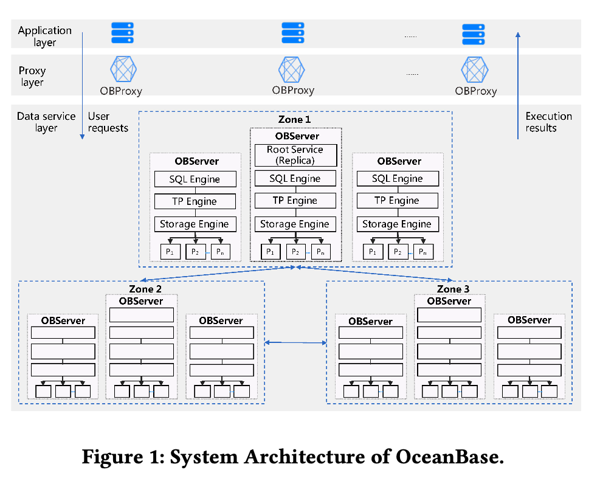

# (Paper Reading) Manu: A Cloud Native Vector Database Management System

时隔几周，又来更新了。这几周时间比较碎片，没有找到比较好的机会写文。话不多说，开整。

今天这篇文章是还是 VLDB 上的一篇文章，主要讲了 OceanBase 的整体架构和设计经验。主要包括 OceanBase 的设计目标、设计标准、整体架构、关键组件以及相关的设计经验。主要分成下面五个部分，这篇文章也主要从这五个部分来展开：
- OB 的设计目标和标准、系统架构、SQL 引擎以及多租户实现
- OB 使用的基于 LSM tree 的存储引擎、非对称读写设计、增量压缩和副本类型等
- OB 的事务处理引擎、隔离级别和复制表
- TPC-C benchmark test。这个噱头十足，等下可以仔细看看。
- 构建 OB 过程中的设计经验

从技术选型来看，OB 使用了分布式数据库系统中常用的一些技术：LSM tree、Paxos等等，当然这部分各种分布式数据库的实现都是大同小异，没有最完美的设计，只有尽可能贴近当前业务场景的Best Practice。

老规矩看下 chatGPT 怎么说。

```
OceanBase是由中国阿里巴巴集团开发的分布式关系型数据库系统。它是阿里巴巴公司的自主研发项目之一，旨在满足其海量数据存储和高并发访问的需求。OceanBase在设计上借鉴了Google的Spanner和F1等分布式数据库系统的一些思想。

主要特点和优势：

1. 分布式架构：OceanBase是一个分布式数据库系统，它将数据划分成多个分片并在多台服务器上存储，以实现数据的高可用性和可扩展性。

2. ACID事务支持：OceanBase支持ACID（原子性、一致性、隔离性和持久性）事务，这意味着它可以保证数据在并发环境下的一致性和完整性。

3. 高并发读写：作为用于大规模在线服务的数据库系统，OceanBase被设计为能够处理高并发读写请求，满足对海量数据的实时访问需求。

4. 水平扩展：OceanBase可以通过添加更多的节点来实现水平扩展，以应对数据量和访问量的增长。

5. 多租户支持：OceanBase支持多租户架构，允许将不同的应用和用户隔离在不同的数据库实例中，提供更好的安全性和资源隔离。

6. 多数据模型支持：除了关系型数据模型，OceanBase还支持存储非结构化数据和半结构化数据，使其能够适应不同类型的应用场景。
```

## 整体设计
OB 的设计目标是为了在商用级硬件上构建可快速伸缩的高性能、低成本数据库，需要满足可跨区域部署、错误容忍等需求，OB 需要兼容常见的主流数据库，这也和设计 OB 时的时代背景有关，如果没记错应该是在 10 年前后，当时国内也没有像现在一样百花齐放，淘宝当时使用的主要还是 Oracle、MySQL 之类的数据库产品。（这个时间点我刚上大学，完全没有意识到波澜壮阔的中国互联网时代正在拉开帷幕）

首先是 OB 的设计目标，主要有以下几点：
- 支持在商品级硬件上快速伸缩，满足高性能和低成本的要求（这主要是因为 Oracle 真的太贵，卡脖子了）
- 跨区域部署和错误容忍，说白了就是要高可用。
- 兼容主流数据库（因为不兼容的话业务方就不想迁移过来了）
整体来说，这几个设计目标很符合当时的时代背景。

接着是设计标准，对于一个新的数据库而言，总要面临以下挑战：

1. 业务的迁移成本和风险
2. 业务方的学习成本
3. 第三方服务提供者的学习成本

为了应对这些挑战，OB 定下了以下的设计标准：原生兼容主流数据库，考虑各种大中小组织的需求。对各种主流数据库的兼容能够降低业务方的迁移成本和学习成本，适用不同规模组织能够最大成都满足各类业务场景的成本和性能要求。


下面我们来看下基础架构，OB 支持 shared-nothing 架构，如下图所示，这其实是一个很标准的存算分离的架构。应用层发送请求到 proxy 层，由 proxy 层转发到对应的 db 节点，db 节点主要负责计算逻辑，由存储引擎访问底层的存储集群。



每个 OB 集群由多个不同的 zone 组成，不同的 zone 可以部署到单个 region 或者多个 region。在单个 zone 内，OB 是以 shared-nothing 的方式来部署的。Database 被切割成多个分片，这些分片是数据分布和负载均衡的基本单元。每个 partition 在每个 zone 都有一个副本，zone 与 zone 之间通过 Paxos 来同步。

单个 OB 节点和传统的关系型数据库差不多，接收到 SQL语句后，会把语句编译成执行计划，本地计划直接执行，跨节点计划采用两阶段提交来实现，事务提交在 redo log 被持久化到多数的 Paxos 节点后。

OB 中有多个 Paxos 组，其中一个组负责整个集群的调度、负载均衡、节点管理、失败检测等工作。

```
"Shared-nothing"是一种计算机系统架构和设计模式，主要用于构建分布式系统。在shared-nothing架构中，不同的节点（计算机或服务器）之间不共享任何主要资源，如内存、存储或处理器。每个节点都是独立的、自治的单元，其操作不会影响其他节点。

主要特点和优势：

1. 高可伸缩性：由于每个节点都是独立的，shared-nothing架构可以轻松地通过添加更多的节点来扩展整个系统的性能和处理能力。这使得系统能够适应不断增长的数据和用户需求。

2. 高可用性：由于节点之间不共享资源，一个节点的故障通常不会对其他节点产生影响。这种独立性使得shared-nothing系统具有高度的容错性和可用性。

3. 简化系统管理：每个节点都是独立的，不需要复杂的资源管理和协调。这样可以降低系统管理的复杂性，简化系统维护和故障排除。

4. 避免资源竞争：由于节点之间不共享资源，不会出现资源竞争的情况。这可以避免锁和同步等问题，提高系统的并发性能。

5. 数据分区：在shared-nothing系统中，数据通常被分散存储在不同节点上，每个节点负责管理自己的数据。这种数据分区可以提高系统的负载均衡和查询性能。

shared-nothing架构通常在大规模的分布式数据库系统、分布式文件系统和云计算平台等领域得到广泛应用。著名的shared-nothing数据库系统包括Google的Bigtable和Amazon的DynamoDB。这种设计模式对于构建高性能、高可扩展性和高可用性的分布式系统非常有益。
```

